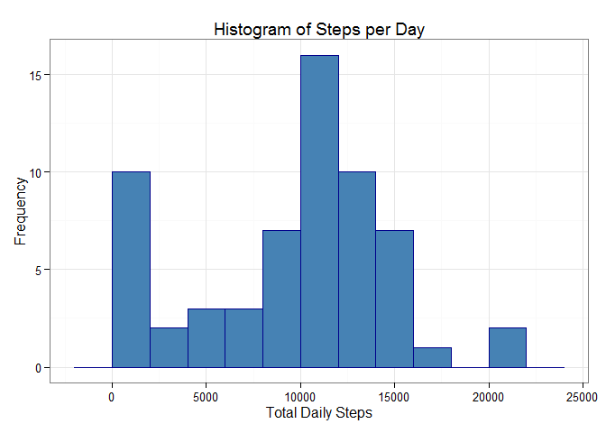
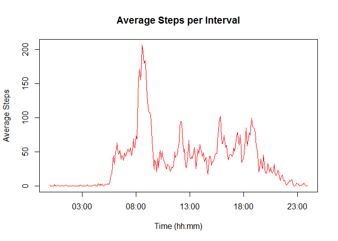
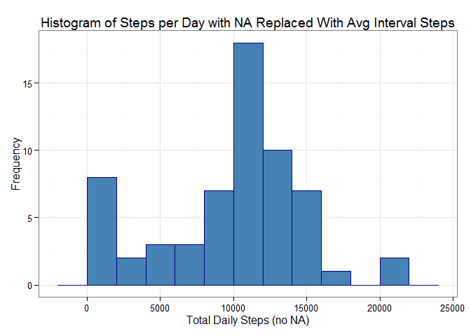
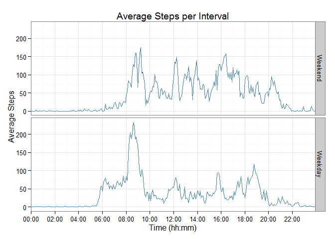

# Reproducible Research: Peer Assessment 1


## Loading and preprocessing the data

```r
src_fr <- read.csv("activity.csv",header=TRUE,sep= ",")
```
## What is mean total number of steps taken per day?

####1. Calculate the total number of steps taken per day

```r
library(plyr)
total_daily_steps<-ddply(src_fr,"date",summarize,TotalSteps=sum(steps,na.rm=TRUE))
```

####2. Histogram of the total number of steps taken each day    

Create a ggplot object;

```r
library(ggplot2)
p<-ggplot(total_daily_steps, aes(x=TotalSteps)) 
```
Frame as a histogram;

```r
p<-p+ geom_histogram( binwidth = 2000,color="darkblue",fill="steelblue")
```
Format the background, add a title and rename the axes;  

```r
p+theme_bw() +labs(title = "Histogram of Steps per Day", x = expression("Total Daily Steps"), y = "Frequency")
```

 

####3. Calculate and report the mean and median of the total number of steps taken per day

```r
meansteps<-mean(total_daily_steps$TotalSteps)
mediansteps<-median(total_daily_steps$TotalSteps)

meansteps
```

```
## [1] 9354.23
```

```r
mediansteps
```

```
## [1] 10395
```

## What is the average daily activity pattern?

####1. Make a time series plot (i.e. type = "l") of the 5-minute interval(x-axis) and the average number of steps taken, averaged across all days (y-axis)  
Note that we are converting the interval from an integerinto a clock time.

```r
avg_interval_steps<-ddply(src_fr,"interval",summarize, AvgSteps=mean(steps,na.rm=TRUE))

#convert the integers to 4 character strings with leading zeros
avg_interval_steps$time_of_day<-sprintf("%04d",avg_interval_steps$interval)
#convert to an object of class POSIXct
avg_interval_steps$time_of_day<-strptime(avg_interval_steps$time_of_day,"%H%M")
avg_interval_steps$time_of_day<-as.POSIXlt(avg_interval_steps$time_of_day)

plot(avg_interval_steps$time_of_day,avg_interval_steps$AvgSteps,type="l",col="red",main="Average Steps per Interval",xlab="Time (hh:mm)",ylab="Average Steps")
```

 

####2. Which 5-minute interval, on average across all the days in the dataset, contains the maximum number of steps? 
Sort by average steps and then return the interval in row 1;

```r
sorted_int_steps <- arrange(avg_interval_steps,desc(avg_interval_steps$AvgSteps))
sorted_int_steps$interval[1]
```

```
## [1] 835
```
## Imputing missing values

####1. Calculate and report the total number of missing values in the dataset (i.e. the total number of rows with NAs)

```r
missingcount<-sum(is.na(src_fr$steps))
missingcount
```

```
## [1] 2304
```

####2. Devise a strategy for filling in all of the missing values in the dataset. The strategy does not need to be sophisticated. For example, you could use the mean/median for that day, or the mean for that 5-minute interval, etc

*Let's use the average steps per interval to replace the NAs.*  

####3. Create a new dataset that is equal to the original dataset but with the missing data filled in.

```r
copy_src<-src_fr

options(warn=-1)

rep_avg_interval_steps=rep(avg_interval_steps$AvgSteps,len=dim(src_fr)[1])
copy_src$newsteps<-copy_src$steps
#Where the steps are NA we use the average number of steps for that interval
copy_src$newsteps[is.na(copy_src$steps)]<-is.na(copy_src$steps)*rep_avg_interval_steps
```

####4. Make a histogram of the total number of steps taken each day and Calculate and report the mean and median total number of steps taken per day. Do these values differ from the estimates from the first part of the assignment? What is the impact of imputing missing data on the estimates of the total daily number of steps?

```r
new_total_daily_steps<-ddply(copy_src,"date",summarize, TotalSteps=sum(newsteps,na.rm=TRUE))
```

Create ggplot object;  

```r
p2<-ggplot(new_total_daily_steps, aes(x=TotalSteps)) 
```
Frame as a histogram;  

```r
p2<-p2+ geom_histogram(binwidth = 2000,color="darkblue",fill="steelblue")
```
Format the background, add a title and rename the axes;  

```r
p2+theme_bw() +labs(title = "Histogram of Steps per Day with NA Replaced With Avg Interval Steps", x = expression("Total Daily Steps (no NA)"), y = "Frequency")
```

 

Calculate and report the mean and median of the total number of steps taken per day;

```r
newmeansteps<-mean(new_total_daily_steps$TotalSteps)
newmediansteps<-median(new_total_daily_steps$TotalSteps)

newmeansteps
```

```
## [1] 9707.219
```

```r
newmediansteps
```

```
## [1] 10571
```

*The impact of replacing NA values with the mean steps per interval is that the spike in the 0-2000 interval is much smaller and the mean and median have both increased and this is reflected in a much higher peak at the 10,000 - 12,000 interval.*

## Are there differences in activity patterns between weekdays and weekends?

####1. Create a new factor variable in the dataset with two levels - "weekday" and "weekend" indicating whether a given date is a weekday or weekend day.

Assuming we're back to the original data set (ie ignoring NAs);

```r
weekdaysvar<-c("Monday","Tuesday","Wednesday","Thursday","Friday")

src_fr$weekdayfact<-factor((weekdays(as.Date(src_fr$date))%in% weekdaysvar),levels=c(FALSE, TRUE), labels=c('Weekend', 'Weekday'))

#As before, let's make the interval look more meaningful.
#convert the integers to 4 character strings with leading zeros
src_fr$time_of_day<-sprintf("%04d",src_fr$interval)
#convert to an object of class POSIXct
src_fr$time_of_day<-strptime(src_fr$time_of_day,"%H%M")
src_fr$time_of_day<-as.POSIXct(src_fr$time_of_day, tz = "UTC")
```

####2. Make a panel plot containing a time series plot (i.e. type = "l") of the 5-minute interval (x-axis) and the average number of steps taken, averaged across all weekday days or weekend days (y-axis).

```r
avg_interval_steps<-ddply(src_fr,c("time_of_day","weekdayfact"),summarize, AvgSteps=mean(steps,na.rm=TRUE))

library(scales)
lims <-as.POSIXct(c(min(avg_interval_steps$time_of_day),max(avg_interval_steps$time_of_day)))

p<-ggplot(avg_interval_steps, aes(x=time_of_day,AvgSteps))
p + geom_line(color="steelblue") + facet_grid(weekdayfact ~ .)+ theme_bw()+labs(title = "Average Steps per Interval", x = expression("Time (hh:mm)"), y = "Average Steps") + scale_x_datetime(labels = date_format("%H:%M"), breaks = date_breaks("2 hour"), limits = lims, expand = c(0, 0))
```

 
